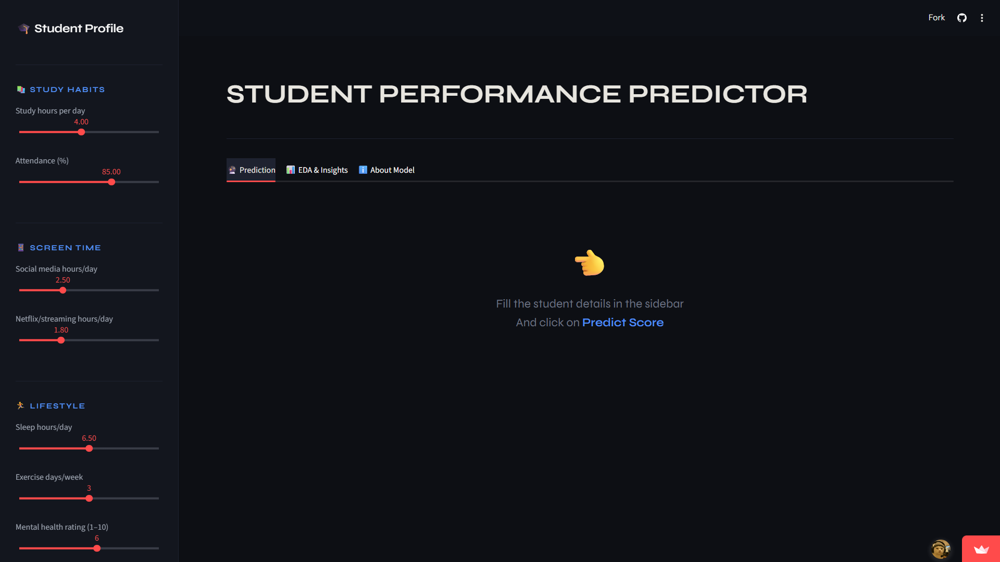
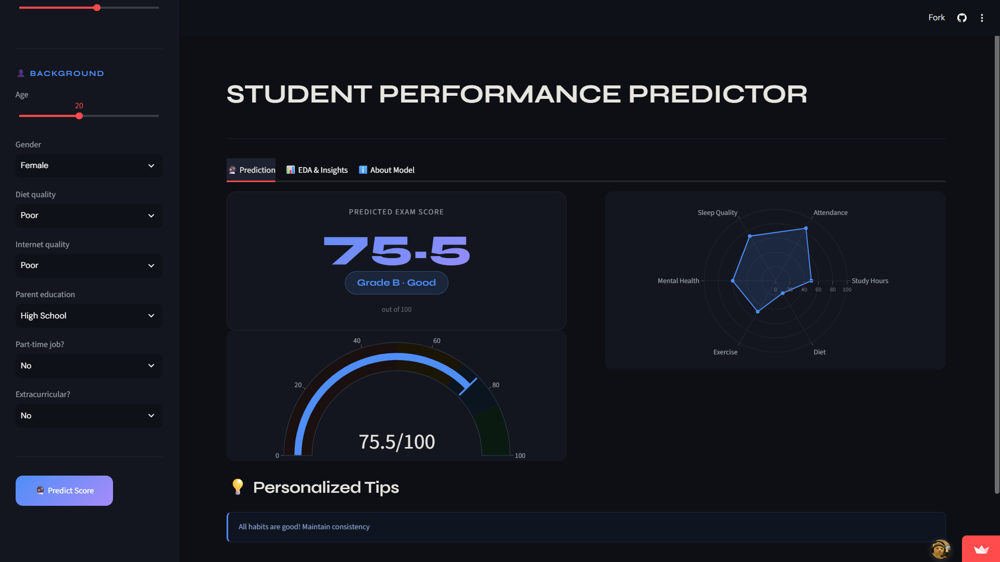
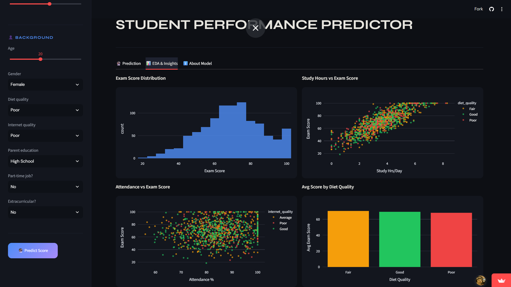
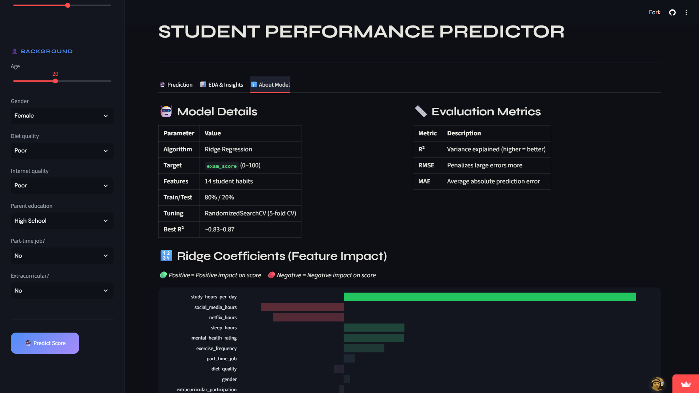

# 🎓 Student Performance Predictor

An interactive **Machine Learning web application** that predicts a student's exam score using academic, behavioural, lifestyle, and background factors.

The project combines a regression model with an interactive **Streamlit dashboard** to provide a predicted score, grade indicator, habit analysis, EDA visualizations, model information, and personalized tips.

---

## 🚀 Live Project

**Web App:** https://ashish-student-predictor.streamlit.app  
**GitHub Repository:** https://github.com/ashish-dev-hub/student-predictor

---

## 📌 Project Overview

Student academic performance is influenced by more than study time alone. This project uses multiple measurable student characteristics to build a regression-based prediction system.

The application allows a user to enter a student profile and receive:

- Predicted exam score
- Grade and performance label
- Score gauge
- Habit-analysis radar chart
- Personalized improvement tips
- Exploratory Data Analysis (EDA)
- Model details and feature-impact visualization

---

## 🎯 Objectives

- Predict student exam scores using Machine Learning.
- Study the relationship between student habits and academic performance.
- Compare regression-based approaches.
- Build an easy-to-use interactive prediction interface.
- Present model insights through visualizations.

---

## 📊 Dataset

The project uses a student-habits performance dataset containing:

- **1,000 student records**
- **16 columns**
- **14 predictive student features**
- Target variable: **`exam_score`**

### Key Features

| Feature | Description |
|---|---|
| `age` | Student age |
| `gender` | Gender category |
| `study_hours_per_day` | Daily study hours |
| `social_media_hours` | Daily social-media usage |
| `netflix_hours` | Daily streaming usage |
| `part_time_job` | Whether the student has a part-time job |
| `attendance_percentage` | Attendance percentage |
| `sleep_hours` | Daily sleep duration |
| `diet_quality` | Diet quality |
| `exercise_frequency` | Exercise days per week |
| `parental_education_level` | Parent's education level |
| `internet_quality` | Internet quality |
| `mental_health_rating` | Mental-health rating |
| `extracurricular_participation` | Extracurricular participation |
| `exam_score` | Target exam score |

---

## 🧠 Machine Learning Workflow

```text
Dataset
   ↓
Data Inspection
   ↓
Exploratory Data Analysis
   ↓
Preprocessing & Encoding
   ↓
Feature Analysis
   ↓
Train / Test Split
   ↓
Model Training
   ↓
Model Evaluation
   ↓
Ridge Regression
   ↓
Interactive Prediction Dashboard
```

The application loads the trained model, scaler, and feature names from saved files and converts the user's input into the required feature format before generating a prediction.

---

## 🤖 Model

The project explores several regression approaches, including:

- Linear Regression
- Ridge Regression
- Random Forest Regressor

The deployed application uses **Ridge Regression**.

### Model configuration shown in the application

- **Algorithm:** Ridge Regression
- **Target:** `exam_score`
- **Features:** 14 student habits
- **Train/Test Split:** 80% / 20%
- **Cross-validation:** 5-fold tuning

> The model-information values shown in the current dashboard are kept consistent with the application UI. The notebook contains the detailed model comparison and evaluation workflow.

---

## 📈 Evaluation Metrics

The project evaluates regression models using:

### R² Score
Measures the proportion of target variance explained by the model. Higher is better.

### RMSE
Root Mean Squared Error. Larger prediction errors are penalized more heavily.

### MAE
Mean Absolute Error. Represents the average absolute prediction error.

The notebook's final model evaluation reports approximately:

- **R²: 0.8988**
- **RMSE: 5.09**
- **MAE: 4.14**

---

## 🔍 Key Insight

Feature analysis shows that **study hours per day** has the strongest positive relationship with the predicted exam score in the trained model.

The dashboard also visualizes the effects of factors such as:

- Social media usage
- Netflix/streaming usage
- Sleep
- Mental health
- Exercise
- Diet
- Attendance

> These model coefficients describe relationships learned from the dataset; they should not be interpreted as proof of direct causation.

---

## 💻 Web Application

The application is built with **Streamlit** and provides three main sections:

### 🔮 Prediction

Users enter student information through the sidebar and click **Predict Score**.

The app then displays:

- Predicted exam score
- Grade
- Performance label
- Gauge chart
- Habit radar chart
- Personalized tips

### 📊 EDA & Insights

The dashboard contains:

- Exam score distribution
- Study hours vs exam score
- Attendance vs exam score
- Average score by diet quality
- Correlation heatmap

### ℹ️ About Model

The application presents:

- Model details
- Evaluation metrics
- Ridge coefficients
- Feature impact visualization

---

## 🖼️ Screenshots

### 1. Prediction Dashboard



### 2. Prediction Result



### 3. EDA & Insights



### 4. Model Details & Feature Impact



---

## 🛠️ Tech Stack

### Programming
- Python

### Machine Learning
- Scikit-learn
- Joblib

### Data Processing
- Pandas
- NumPy

### Visualization
- Plotly

### Web Application
- Streamlit

---

## 🔐 Required Model Files

Make sure these files are present in the project directory:

```text
ridge_model.pkl
scaler.pkl
feature_names.json
student_habits_performance.csv
```

The Streamlit application loads these files when starting.

---

## 🌱 Future Scope

- Use a larger and more diverse student dataset.
- Add explainable-AI techniques such as SHAP.
- Improve personalization of recommendations.
- Add model versioning and automated retraining.
- Deploy the application for real-world educational use.
- Explore more advanced ensemble and deep-learning approaches.

---

## 👨‍💻 Project

**Student Performance Predictor**  
Built for **data-driven academic insights** using Machine Learning.

### Built with

**Python • Pandas • NumPy • Streamlit**

---

## ⭐ Support

If you find this project useful, consider giving the repository a ⭐ on GitHub
